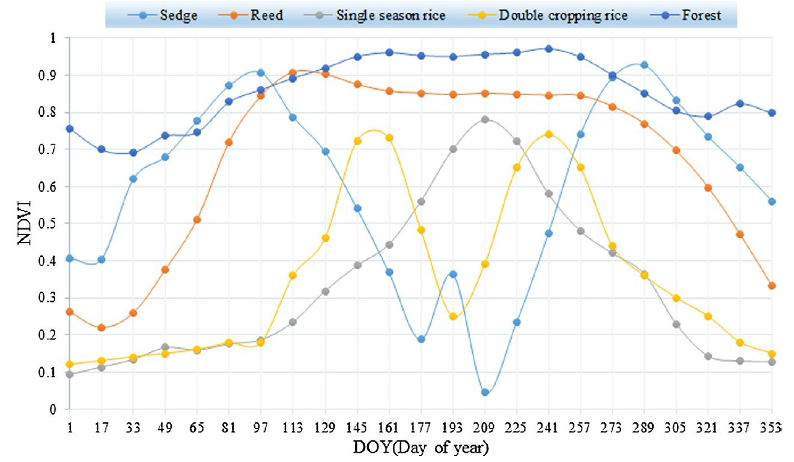

---

## Problem Statement
- The challenge's goal is to predict the presence or non-presence of rice crops at a given location.
- This challenge will consider satellite data from the European Copernicus (Sentinel-1 and Sentinel-2) program and NASA's Landsat program.

## Data Extraction
Satellite data is a unique and valuable tool for studying agriculture. Participants considered using optical data from Sentinel-2 and Landsat and radar data from Sentinel-1 in this challenge. All of these datasets are readily available from the Microsoft Planetary Computer ([HERE](https://planetarycomputer.microsoft.com/catalog)). Participants can choose one or more of these satellite datasets for their solution.
- Extracting data over An Giang province in the Mekong Delta in Vietnam.
- 5x5 bounding boxes from November 2021 to August 2022

### Optical Data from Sentinel-2
Quality Landsat data has been around since the early 1980s with a spatial resolution of 30 meters per pixel and a revisit of 16 days for one mission. We currently have two operational missions (Landsat-8 and Landsat-9) yield 8-day revisits at any location. The launch of the European Copernicus Sentinel-2 missions in 2015 and 2017 added new optical data at a higher 10-meter spatial resolution and a revisit every ten days with one mission and every five days with two missions. So, the combination of Landsat and Sentinel-2 missions (4 total) can observe the ground four times every ten days. This coverage combination can yield coincident revisits about nine times per year, but five days between views of the ground is the best. But, the issue with optical data is that it cannot penetrate clouds. So, the data is not usable if a cloud is over any given location. In the case of Vietnam, clouds are persistent over any one location about 2/3 of the time, so only 1/3 of the data is available in a given year. In addition, our ability to identify these clouds in the data could be better, so we often have issues with data contaminated by clouds, which impacts the results of models.
Optical data (e.g., Landsat or Sentinel-2) contains many spectral bands (e.g., Red, Green, Blue, Red-Edge, NIR, SWIR, etc.) that can be related to the presence or growth of rice crops. As you review the references, you will find that researchers often use statistical combinations of these bands, called indices, to build models. One of the more common indices for agriculture is the Normalized Difference Vegetation Index (NDVI). Still, many others exist, including the Enhanced Vegetation Index (EVI) and the Soil Adjusted Vegetation Index (SAVI). Optical data is used to measure the "greenness" of vegetation during the growth cycle. Differences in band or index values can be used to distinguish differences in crop types (see Figure) and crop yield.

### SAR Data from Sentinel-1
One of the more exciting satellite data advancements was the Sentinel-1 radar missions launched in 2014 and 2016. While satellite radar has existed since the early 1990s, the Sentinel-1 system provides time-series radar data at an unprecedented temporal repeat. Since all radar data can penetrate clouds, it has some advantages over optical data in regions such as Vietnam with high cloud cover. The Sentinel-1 mission uses C-band radar at 10-meter resolution with a single mission revisit every 12 days. Unfortunately, one of the two Sentinel-1 missions failed in December 2021, so we currently have only one Sentinel-1 mission. A critical aspect of the Sentinel-1 data on the Microsoft Planetary Computer is that the data includes Radiometric Terrain Correction (RTC), which accounts for terrain variations that affect both the position of a given point on the Earth's surface and the brightness of the radar return. Without RTC treatment, the hill-slope modulations of the radiometry threaten to overwhelm weaker thematic land cover-induced backscatter differences.
In the case of radar data, the Sentinel-1 missions operate in the C-band frequency, corresponding to a 5.6 cm wavelength. The radar signal can be transmitted and received at horizontal (H) or vertical (V) polarization. The Sentinel-1 data contains two basic polarization "bands," VV and VH, with the first letter indicating the transmitted polarisation and the latter the received polarization. The VV and VH bands give us surface backscatter at any location. This backscatter tells us about the "structure" of the crop, such as its growth progress from small to large plants and then to bare soil after harvesting (see Figure).

VV and VH band backscatter information can also be used to build crop detection and yield models. Similar to optical indices, it is possible to develop statistical combinations of the VV and VH band data to improve modeling results. One of the more common indices is the Radar Vegetation Index (RVI), which tends to mimic the properties of optical NDVI, but not exactly. A typical equation for RVI is shown below, but researchers use other variations of this index.

**RVI (Radar Vegetation Index)**

$$
\text{RVI} = \frac{\frac{VH}{VV} \left( \frac{VH}{VV} + 3 \right)}{\left( \frac{VH}{VV} + 1 \right)^2}
$$ 

As discussed previously, it is possible to use optical and radar data to track these growing stages over time. Optical data will tell us about the "greenness" of the plant, and radar data will tell us about the "structure" of the plant. For example, peak "greenness" occurs before full plant maturity as the rice grain is formed before harvest. In the case of "structure," which can be measured with radar data, we can see differences in scattering at the various growth stages. Less scattering might be observed in the early stages due to reflections from background soil or flooded fields. The peak flowering stage may see maximized scattering due to dense foliage. In contrast, during the ripening stage before harvest, there may be a drop in scattering due to rice tassel formation and "layover" of the plant. In the end, there will be differences between the optical and radar phenology, but it is still possible to relate this data to the growth stages and build a good yield model.

## Data Pre-processing

### Optical Data
- Mean Aggregation over 5x5 bboxes
- Cloud Coverage Correction
- Missing Value Imputation
- Exponential Smoothing
- MinMax Scaler

### SAR Data
- Mean Aggregation over 5x5 bboxes
- Missing Value Imputation
- MinMax Scaler

## Feature Engineering

### SAR Data
- RVI
- Polarity Index
- Proxy NDVI

### Optical Data
- NDVI
- Leaf Area Index
- SAVI
- EVI

## Feature Selection
- Variance Thresholding
- RFECV with XGBoost to select 100 features

<!-- TODO: add tsne plot with explanation -->

## Data Modeling

### Sample Evaluation
- This is used to find difficult to classify samples
- Run [nested-CV](https://scikit-learn.org/stable/auto_examples/model_selection/plot_nested_cross_validation_iris.html) for N seeds
- Rank the accuracy/f1_score of each seed in descending order
- The worst performing M seeds are selected to be used for model tuning

### Model Selection
- SVM
- Decision Trees and RF
- Gradient Boosting Classifiers
- Linear Classifiers
- MLPs

### Model Tuning
- Using nested cross-validation, perform hyperparameter tuning for a selected model on the worst M seeds.
- An ensemble Voting classifier comprises the tuned selected models on each K cross-validation fold.
- This is further nested for each of the M seeds, resulting in an MxK nested voting classifier.

### Ensemble Learning
- Model tuning is carried out for each of the selected classes of models.
- A New Voting and Stacked Classifier is built using different tuned model combinations.
    - T is the number of different classes of ML models used 
    - Then, combinations are made, and the choice of 1,...., T of the models is used to create a final classifier.
- After this step, the final model is tested on the Hold-out set. The best-performing model is used for training on the complete dataset to build the final model.

## Model Evaluation and Experimentation
- Each model is tuned using a weighted f1 score using nested-cv
- Each tuned model and ensemble is evaluated using the most difficult-to-predict `cv_seeds` using cross-validation.
- Further experimentation is carried out using combinations of models in the voting classifier to find the best model.
- All experiments are tracked and analyzed using Weights & Biases.

## Observations and Learnings
1. In this project, we learned the importance of crafting a good cross-validation strategy. From the start, we could see that using a "Vanilla" CV strategy would not give correlated performance to the submission dataset. For example, in our first few submissions, we could see a difference of more than 30\% in out-of-sample performance on the hold-out set compared to the submission set.

2. By the end of the project, using our final CV strategy, the difference between the performances on the CV and submission sets was about 3-5\%. We can safely say that this strategy equipped our model to learn better representations from the data that transfer well to the submission set.

3. Surprisingly, model performance decreased substantially when optical data (5x5 bbox average) from Sentinel-2 was used with or without Sentinel-1 SAR data. From our significant experiments, neither clean (cloud-filtered) nor unclean optical data helped improve performance.

4. We also experimented with feature engineering using exponential smoothing, peak finding in time series, principal component analysis, spline transformations, etc., with limited success. 

5. Experimentation with different classes of models, such as gradient boosting classifiers (XGBoost, LGBM) and Neural Networks (MLPClassifier), among others, did not provide consistent performance improvements and could have been more efficient considering NNs. We expected some upgrades by employing these techniques, but they were not found. So instead, we focused on improving the CV strategy, which made the most significant difference for us on model performance.

## Future Improvements
1. **Advanced Cloud Correction Techniques**: Implement more sophisticated cloud removal techniques, such as cloud shadow correction and multi-temporal cloud interpolation, to improve the quality of optical data.

2. **Temporal Feature Extraction**: Enhance temporal feature engineering by incorporating techniques like Fourier transforms or wavelet transforms to capture periodic patterns and seasonal variations more effectively.

3. **Multisource Data Fusion**: Develop more advanced methods for fusing optical and SAR data, such as deep learning-based fusion techniques that can capture complementary information from both data sources.

4. **Deep Learning Models**: Explore state-of-the-art deep learning models such as convolutional neural networks (CNNs) for spatial feature extraction and recurrent neural networks (RNNs) or transformers for temporal feature learning.

5. **Geospatial Data Augmentation**: Perform data augmentation on satellite images to increase the diversity and robustness of the training data, such as rotations, translations, and scaling.

6. **Integration of Auxiliary Data**: Incorporate auxiliary data sources such as weather data, soil properties, and topographical data to provide additional context and improve model predictions.